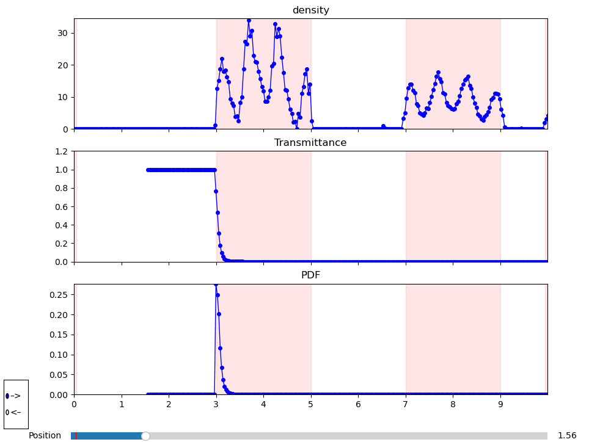

# 1D NeRF

Simple implementation of NeRF in 1D with visualization.

The supervision signal is depth. You just need to specify boundaries of objects. During training shoot rays in two directions (–> or <–) and predict depth from the ray origin.

This setup allows to quickly test NeRF ideas and visualize them.

Here is how the interactive visualization looks like:

